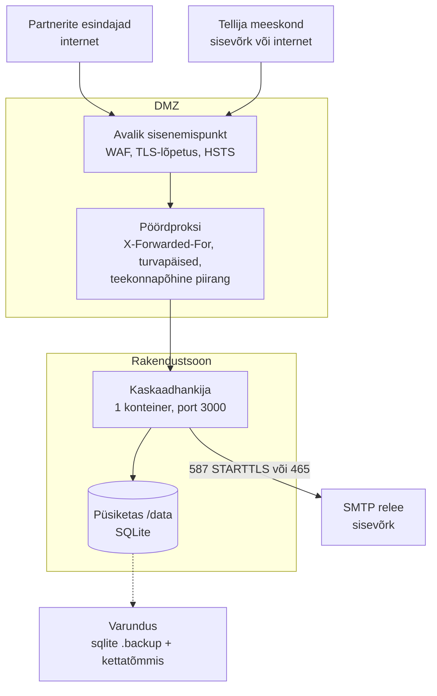

# Kaskaadhankija — juurutusjuhend tellija taristusse

*Seis: 14.09.2026. Kaasdokument: [`tehniline-ulevaade.md`](tehniline-ulevaade.md) (kuidas süsteem töötab). Praeguse testkeskkonna (Fly.io) eripärad on `README.md` jaotises „Deployment“ ja failis `fly.toml`.*

**Summary (English).** To host Kaskaadhankija the buyer's IT needs: one container image built from the repository's `Dockerfile`, **exactly one running instance**, one persistent disk for the SQLite file, one public hostname with TLS, and an SMTP relay for outbound mail. Nothing else — no database server, no queue, no outbound calls except SMTP. This guide gives a recommended topology for a private or hybrid cloud (Kubernetes or a single VM), the configuration and secrets, step-by-step SMTP wiring, the first boot, operations (health, logs, backup, upgrades), security notes and a go-live checklist.

## 1. Nõuded ühel lehel

| Vajadus | Täpsustus |
|---|---|
| Konteinerikuvand | ehitatakse `Dockerfile`-ist (Node 22, Debian slim); ehitamisel on vaja ainult npm-registrit; käitusel ei laadita midagi väljast |
| Käitus | **täpselt üks eksemplar**; 1 vCPU ja 1–2 GB RAM on küllaga; port 3000; kasutaja `node` (mitte root) |
| Püsiketas | `/data` — SQLite fail ja tema WAL-sidefailid; 1–10 GB on rohkem kui vaja; üks kirjutaja (ReadWriteOnce) |
| Võrk sisse | HTTPS **avalikust internetist** (partnerite esindajad on väljaspool tellija võrku) → pöördproksi → HTTP :3000 |
| Võrk välja | ainult SMTP relee (587 või 465); muud väljaminevat ühendust rakendus ei tee |
| DNS ja sertifikaat | üks hostinimi; TLS lõpetatakse proksis; `APP_BASE_URL` on sama hostinimi |
| E-post | relee konto; saatja-aadress tellija domeenil, mida SPF/DKIM/DMARC katab |
| Saladused | `AUTH_SECRET`, `SMTP_PASS` — platvormi saladuste hoidlas |
| Aeg | NTP — vastamistähtajad on päris hetked; ajavöönd on koodis (Europe/Tallinn), konteineri `TZ` ei loe |

## 2. Soovitatav topoloogia privaat- või hübriidpilves



**Kaks võrdväärset viisi:**

- **Kubernetes / OpenShift.** `Deployment` `replicas: 1`, `strategy: Recreate` (mitte `RollingUpdate` — kaks podi avaksid sama faili), `PersistentVolumeClaim` `ReadWriteOnce` haagitud `/data`, `readinessProbe` ja `livenessProbe` `GET /api/health` (`initialDelaySeconds: 20` — käivitus rakendab migratsioonid), keskkond ja saladused `Secret`-ist, `Ingress` TLS-iga. Ei `HorizontalPodAutoscaler`-it ega mitut replikat.
- **Üks virtuaalmasin.** Podman või Docker `systemd` teenusena (`Restart=always`), ketas seotud `/data` alla, ees nginx/Caddy/Traefik TLS-iga. Näide `compose`-kujul:

```yaml
services:
  kaskaadhankija:
    image: register.example.ee/kaskaadhankija:2.7.0
    restart: always
    ports: ["127.0.0.1:3000:3000"]   # ainult proksile
    volumes: ["/srv/kaskaadhankija/data:/data"]
    env_file: /srv/kaskaadhankija/kaskaadhankija.env   # vt § 4; saladused hoidlast
```

**Pöördproksi nõuded:** edastab `Host`, `X-Forwarded-For` (esimene aadress = klient; kliendi enda saadetud päis kustutada serval), `X-Forwarded-Proto`; lubab päringu keha vähemalt **5 MB** (töövihikute üleslaadimine) ja ajapiiri vähemalt 60 s (import, PDF). Valikuline **teekonnapõhine piirang**: `/tellija/*` ja `/api/health` ainult tellija võrgust; `/sisene`, `/partner/*`, `/juhend`, `/_next/*` avalikud (tellija meeskond logib sisse sama `/sisene` kaudu).

## 3. Kuvandi ehitamine

```bash
docker build -t register.example.ee/kaskaadhankija:2.7.0 .
docker push register.example.ee/kaskaadhankija:2.7.0
```

Mitmeastmeline ehitus; tulemus on Next `standalone` väljund koos natiivse SQLite-mooduli, migratsioonide, näidisandmete ja PDF-fontide meetrikaga — ehitus **katkeb**, kui mõni neist puudub (`Dockerfile` kontrollid; sama kontrollib CI). Soovitus: ehitada tellija CI-s märgistatud kommitist, kuvandit skannida (nt Trivy) ja hoida eelmine silt tagasipööramiseks alles.

## 4. Konfiguratsioon ja saladused

Kõik muutujad loetakse käivitusel ühes kohas ja vigane väärtus peatab käivituse selge teatega. Toodangu komplekt:

```bash
# fail kaskaadhankija.env — saladused (AUTH_SECRET, SMTP_PASS) hoidlast, mitte failist
DATABASE_PATH=/data/kaskaadhankija.db
APP_BASE_URL=https://kaskaad.riigikantselei.ee      # kõik lingid kirjades
# DEMO_MODE jäetakse ära: ei valikulehte, ei märgist, ei lühendatud tähtaegu
SEED_SAMPLE_DATA=0                                  # tühi andmebaas, mitte väljamõeldud partnerid (loetakse ainult esimesel käivitusel)
AUTH_SECRET=<openssl rand -hex 32>                  # üks kord; roteerimine logib kõik välja
AUTO_ADMIN_ALLOWLIST=eesnimi.perenimi@riigikantselei.ee   # nimeliselt, mitte @domeen
SMTP_HOST=smtp.riigikantselei.ee
SMTP_PORT=587
SMTP_SECURE=0
SMTP_REQUIRE_TLS=1
SMTP_USER=<tehniline konto>
SMTP_PASS=<saladus>
SMTP_TIMEOUT_MS=15000
EMAIL_FROM=Kaskaadhankija <koolitused@riigikantselei.ee>
EMAIL_ALLOWED_RECIPIENTS=@riigikantselei.ee         # meeskond; partnerid tuletatakse raamhanke andmetest
TEAM_NOTIFICATIONS_EMAIL=koolitused@riigikantselei.ee
```

Märkused: `NODE_ENV=production` on kuvandis ette antud ja lülitab sessiooniküpsisele `Secure` lipu; `EMAIL_DEV_MODE` peab toodangus puuduma (kirjutaks kirjad koos sisenemiskoodidega logisse); `EMAIL_ALLOWED_RECIPIENTS` tühjaks jätmine lubaks toodangus kõiki tuletatud aadresse — nimetatud domeen on rangem ja soovitatav. Iga muutuja selgitus on failis `.env.example`.

## 5. E-posti serveri ühendamine

1. **Relee konto.** Tehniline konto, millel on õigus saata aadressilt `EMAIL_FROM`. Relee peab vastu võtma ühendusi rakenduse väljumis-IP-lt (klastri egress või VM-i aadress) — lisada relee lubatud saatjate hulka.
2. **Port ja TLS.** 587 + STARTTLS → `SMTP_PORT=587`, `SMTP_SECURE=0`, `SMTP_REQUIRE_TLS=1` (relee, mis STARTTLS-i ei paku, lükatakse tagasi). 465 (TLS kohe) → `SMTP_PORT=465`, `SMTP_SECURE=1`. Relee sertifikaat peab kehtima relee hostinime kohta — sertifikaadi kontrollist mööda minemise lülitit rakenduses ei ole, ja nii peab see jääma.
3. **Saatja ja kättetoimetatavus.** `EMAIL_FROM` tellija domeenil; SPF sisaldab releed, DKIM-allkirjastab relee, DMARC on paigas — partnerite rämpspostifiltrite vastu on see ainus hoob. Partnerid vastavad kirjadele saatja-aadressile: kasutage postkasti, mida keegi loeb.
4. **Kellele tohib kirjutada.** Partnerite aadressid tuletatakse raamhanke andmetest (aktiivsed esindajad ja kontaktisikud) — neid ei seadistata kusagil. `EMAIL_ALLOWED_RECIPIENTS` katab tellija meeskonna; `TEAM_NOTIFICATIONS_EMAIL` on meeskonna koopiate postkast.
5. **Kontroll.** Pärast käivitust `GET /api/health` → `"mail":"smtp"`. Lubatud admini aadress küsib lehel `/sisene` koodi — kood jõuab postkasti (teema „Sisenemiskood NNNNNN — Kaskaadhankija“). Sisse loginult Tellija → Teavitused: iga teate all on iga saaja kirja seis.
6. **Seisud logis.** `sent` — relee võttis vastu (vastus salvestatud); `failed` — viga, korratakse 5 ja 30 min pärast (kokku 3 katset), pärast seda „Saada uuesti“ käsitsi; `suppressed` — saaja ei ole raamhanke kontakt ega loendis, kirja ei üritatud; `skipped` — transporti ei ole või `EMAIL_DEV_MODE`. Serveri logis: `[kaskaadhankija] e-kirja saatmine ebaõnnestus (<aadress>): <viga>`.
7. **Sisemised filtrid.** Sisenemiskoodi kiri ei tohi karantiini jääda — selle ootamine on sisselogimine. Paluge posti meeskonnal saatja-aadress sisemistele saajatele lubada.
8. **Maht.** Ühe vooru kohta umbes *partnerite arv × esindajate arv × 4–6 kirja*: kümne partneri ja kahe esindajaga hankeosas alla 150 kirja vooru kohta; koodikirju sisselogimiste arv.

## 6. Esmakäivitus

1. Otsustage **enne** esimest käivitust `SEED_SAMPLE_DATA=0` — lülitit loetakse ainult seni, kuni andmebaas on seemendamata; vaikimisi laaditakse tühja andmebaasi väljamõeldud näidisandmed (neli hankeosa, kuus fiktiivset partnerit, näidisvoorud).
2. Käivitage. Logis: `[kaskaadhankija] näidisandmeid ei laaditud (SEED_SAMPLE_DATA=0) …` ja `[kaskaadhankija] käivitatud, tähtaegade jälgija töötab`; `GET /api/health` → `ok: true`, `data` nullid.
3. **Esimene admin**: `AUTO_ADMIN_ALLOWLIST` aadress küsib `/sisene` lehel koodi (aadress peab olema ka `EMAIL_ALLOWED_RECIPIENTS` all) ja maandub tellija alal. Kasutajakirje tekib alles koodi kinnitamisel.
4. **Raamhange → töövihik.** Laadige mall alla, täitke lehed Raamleping, Hankeosad (vastamisaeg tööpäevades, töömahu künnis, lubatud piirmäära liigid, `max_osalejaid_ruhmas`), Partnerid (koht, kontaktisik, `uhikuhind` = hind **ühe osaleja kohta**) ja Esindajad; eelvaade → rakenda. Kontaktisikud on sellest hetkest sisselogijad ja e-kirja saajad.
5. **Meeskond**: lisage hankijad ja adminid nimeliselt.
6. **Juhend**: `/juhend` piloodilõigud (`pilotOnly`) kustutada koodist enne päris kasutust (README „Before go-live“); otsustada, kas avalik juhend võib olla otsingumootoritele nähtav (praegu `noindex`).

## 7. Käitamine

| Teema | Kuidas |
|---|---|
| Tervis | `GET /api/health` → 200 `{ ok, baseUrl, mail, data }`; 503, kui andmebaas või migratsioon ei tööta. Häire, kui üle 2 min mitte-200. |
| Logid | stdout, eesliide `[kaskaadhankija]`. Häireread: `käivitamine ebaõnnestus`, `vooru sulgemine ebaõnnestus`, `e-kirja saatmine ebaõnnestus`, `AUTH_SECRET puudub`. Koode logis ei ole. |
| Kättesaadavus | protsess peab **elama**: tähtaegu sulgeb protsessisisene taimer. Nulli skaleerimine või uinutamine on välistatud. Kui protsess oli tähtaja hetkel maas, sulgeb järgmine käivitus või lehe laadimine vooru hiljem — tähtaja hetk ise jääb samaks ja sulgemine on idempotentne. |
| Uuendamine | uus kuvand → peata → käivita (Recreate). Käivitus rakendab ootel migratsioonid (`drizzle/meta/_journal.json` järgi); kõik senised migratsioonid on lisavad, tagasipööramine eelmisele kuvandile on ohutu. Enne uuendust võtta varukoopia. Katkestus on sekundid. |
| Varundus | kord ööpäevas kooskõlaline koopia töötava rakenduse ajal: `sqlite3 /data/kaskaadhankija.db ".backup '/varundus/kaskaadhankija-$(date +%F).db'"` (või SQL `VACUUM INTO`); lisaks ketta tõmmised. **Mitte kopeerida `.db` faili üksi töötava protsessi ajal** — WAL-sidefailid `-wal`/`-shm` kuuluvad juurde. Säilitustähtaeg hanke tõendite korra järgi (aastad). |
| Taastamine | peata rakendus → asenda `/data/kaskaadhankija.db` (kustuta vanad `-wal`/`-shm`) → käivita; migratsioonid rakenduvad vajadusel ise. Proovida läbi enne kasutuselevõttu. |
| Ketas | jälgida vaba ruumi; andmebaas on kümneid megabaite. |
| Koormus | üks protsess kannab koormuse (kümned partnerid, sajad voorud aastas) ilma häälestuseta. |

## 8. Turve

- TLS-lõpetus ja HSTS proksis; sessiooniküpsis on `httpOnly`, `SameSite=Lax`, `Secure`.
- Proksi määrab `X-Forwarded-For` (esimene aadress = klient) — rakendus kasutab seda kinnituste tõendina ja koodipäringute sageduspiirina (10 koodi tunnis IP kohta: ühe NAT-aadressi taga olev suur kontor võib piiri vastu tulla — teadlik kompromiss).
- Turvapäised (`Content-Security-Policy`, `frame-ancestors`, `Referrer-Policy`, `X-Content-Type-Options`) lisada proksis — rakendus ise seab ainult `noindex`.
- Konteiner töötab kasutajana `node`; kirjutab ainult `/data` alla (kirjutuskaitstud juurfailisüsteem koos kirjutatava `/data` ja `/tmp`-iga peaks töötama, kuid ei ole läbi proovitud).
- Saladused ainult platvormi hoidlas; `AUTH_SECRET` roteerimine logib kõik välja — teha ainult teadlikult.
- `/api/health` avaldab ainult arve (hankeosad, partnerid, tellija kasutajad); võib piirata sisevõrgule.
- Sõltuvused on lukustatud (`pnpm-lock.yaml`); soovitus lisada CI-sse `pnpm audit` ja kuvandi skann.
- Jääkriskid [L-08]: sisselogimine on postkasti turvalisus; terve domeeni kirje `AUTO_ADMIN_ALLOWLIST`-is annaks adminiõiguse igale selle domeeni postkastile — kasutada nimelisi aadresse.

## 9. Riigipilve ja hübriidpilve märkused

- Andmed asuvad seal, kus konteiner ja tema ketas — valida Eesti asukoht (riigipilv või lepinguline pilv) ka varukoopiatele.
- Hostinimi tellija domeeni all (nt `kaskaad.riigikantselei.ee`), saatja-aadress samal domeenil.
- Testkeskkonnast (Fly.io) **ei kolita andmeid**: seal on väljamõeldud partnerid. Toodang algab tühjast andmebaasist ja päris raamhanke töövihikust; meeskond lisatakse ekraanil või `SEED_TEAM` kaudu.
- Kui õiguslik hinnang nõuab riiklikku autentimist (TARA / Smart-ID / Mobiil-ID), on vahetuskoht üks liides (`sessionActor()`, `src/server/auth/`); e-posti kood võib jääda partnerite sisselogimiseks.

## 10. Kontroll-loend enne kasutuselevõttu

- [ ] `DEMO_MODE` ja `EMAIL_DEV_MODE` puuduvad; `SEED_SAMPLE_DATA=0` oli paigas enne esimest käivitust
- [ ] `APP_BASE_URL` on avalik hostinimi (kirjade lingid viivad õigesse kohta)
- [ ] `AUTH_SECRET` genereeritud ja hoidlas; `AUTO_ADMIN_ALLOWLIST` nimeline
- [ ] `GET /api/health` → `mail: smtp`; proovikood jõuab postkasti; `SMTP_REQUIRE_TLS=1` (587) või `SMTP_SECURE=1` (465)
- [ ] `EMAIL_ALLOWED_RECIPIENTS` = tellija domeen; `TEAM_NOTIFICATIONS_EMAIL` seatud; SPF/DKIM/DMARC katavad saatja
- [ ] Täpselt üks eksemplar, `Recreate`, RWO ketas `/data`; nulli skaleerimine välistatud
- [ ] Proksi: TLS + HSTS, `X-Forwarded-For`, turvapäised, keha ≥ 5 MB, ajapiir ≥ 60 s
- [ ] Varundus käib ja taastamine on läbi proovitud
- [ ] Seire: health-häire, logiridade häire, ketta täituvus
- [ ] Raamhanke töövihik üles laaditud; hankeosade parameetrid kontrollitud raamlepingu tekstiga; kontaktisikud saavad sisse
- [ ] `/juhend` piloodilõigud kustutatud; indekseerimine otsustatud
- [ ] Õiguslik ja andmekaitse ülevaatus tehtud (isikuandmete tabel: tehniline ülevaade § 9); lahtised reeglid L-01, L-05, L-07, L-10, L-12 otsustatud või teadlikult edasi lükatud
