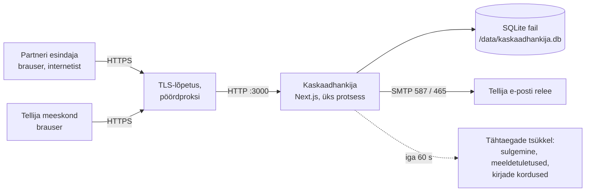
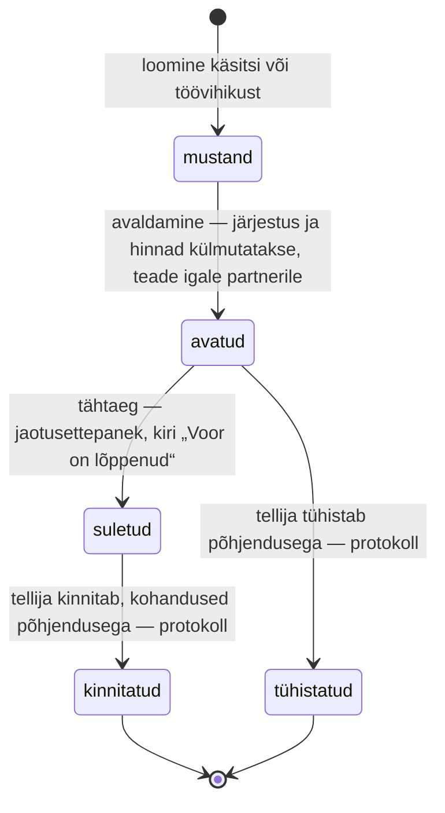

# Kaskaadhankija — tehniline ülevaade

*Seis: 14.09.2026, äriloogika v2.7. Kaasdokument: [`juurutamine.md`](juurutamine.md) (paigaldamine, e-posti server, käitamine). Reeglid: [`kaskaadi-ariloogika.md`](kaskaadi-ariloogika.md).*

**Summary (English).** Kaskaadhankija runs *cascade mini-procurements* under one Estonian framework agreement: the buyer publishes a round of trainings to every partner of a lot at once, partners mark and confirm what they will take within a response window, and at the deadline the allocation is resolved strictly in framework rank order. Technically it is **one Next.js 15 process with an SQLite database on a mounted disk**, an in-process minute timer that closes rounds and sends reminders, and outbound SMTP for e-mail — no other services. Sign-in is by e-mailed one-time code; confirmations and decisions are stored append-only with an audit trail, and every finished round gets a hash-stamped protocol (PDF + .xlsx). The business rules are an Estonian specification with stable rule IDs that the code and the tests cite. The rest of this document is in Estonian: architecture, data, round lifecycle, identity, mail, evidence, personal data, configuration.

## 1. Mis see on

Riigikantselei raamlepingu „Eesti.ai koolitajate tellimine“ (RHR 10567384) alusel tellitakse koolitusi **voorudena**: tellija avaldab hankeosa kõigile partneritele korraga koolituste loendi, partnerid märgivad vastamisaja jooksul, mida on valmis läbi viima, ja tähtajal jaotatakse koolitused rangelt raamlepingu järjestuse alusel. Partner näeb eespool olevate partnerite kinnitatud märgete *mõju*, mitte kunagi nende nime, arvu ega hinda. Rakenduse käitumise alusdokument on `docs/kaskaadi-ariloogika.md` (96 nummerdatud reeglit, nt `[J-04]`); kood, testid ja ekraanitekstid viitavad reeglitele tunnuse kaudu.

| Roll | Kes | Mida teeb |
|---|---|---|
| **admin** (tellija) | tellimismeeskonna liige, nimeliselt lubatud (`AUTO_ADMIN_ALLOWLIST`) või teise admini lisatud | kõik, mida hankija, pluss raamhanke andmed (hankeosad, järjestus, kontaktisikud, esindajad) ja meeskond; testkeskkonnas võib „tegutseda osalejana“ |
| **hankija** (tellija) | meeskonna liige | koolituskalender, voorud mustandist protokollini, ülevaatus ja kinnitamine; loeb raamhanke andmeid, ei muuda |
| **partneri esindaja** | hankeosa kontaktisik või tellija nimetatud lisaesindaja | näeb ainult oma ettevõtte voore; märgib, kinnitab, loeb teateid, haldab oma teavituste lülitit |

## 2. Arhitektuur

| Osa | Valik | Miks nii |
|---|---|---|
| Rakendus | Next.js 15 (App Router, React 19, TypeScript strict); serveripoolsed komponendid ja *server actions*, eraldi API-t ei ole | üks protsess, üks juurutusüksus |
| Andmebaas | SQLite (`better-sqlite3` + `drizzle-orm`), WAL-režiim, fail püsikettal; migratsioonid `drizzle/0000…0014` rakenduvad **käivitusel** (`src/server/boot.ts`) | SQLite järjestab kirjutajad globaalselt — täpselt see garantii, mida kaskaad vajab; eraldi andmebaasiserverit ei ole |
| Ajastus | protsessisisene taimer iga 60 s + sama töö lehe laadimisel; iga voor omas `BEGIN IMMEDIATE` tehingus staatuse ülekontrolliga | idempotentne, ükskõik mitu kutsujat; välist cron'i ei vaja |
| E-post | `nodemailer` üle SMTP; valikuline — ilma `SMTP_HOST`-ita on rakendusesisene teavituste logi ainus kanal | teenusepakkuja vahetus on seadistus, mitte kood |
| Dokumendid | `exceljs` (.xlsx import ja mallid), `pdfmake` (protokolli PDF, standardfondid) | midagi ei laeta väljast |
| Käituskeskkond | Node 22, Debian slim konteiner, kasutaja `node` (mitte root), port 3000, Next `standalone` väljund | kuvandis on kõik vajalik; ainus väljaminev ühendus on SMTP |

Lähtekoodi jaotus: `src/domain` — puhtad reeglid ilma sisend-väljundita (jaotusalgoritm `allocate.ts`, olekud, teadete mallid, impordiridade parsimine, hind, klastrid); `src/server` — mootor (`rounds/engine.ts`), impordid, e-post, teated, sisselogimine, dokumendid, käivitus ja tsükkel; `src/db` — skeem, migratsioonide käivitaja, näidisandmed; `src/app` — ekraanid (`/sisene`, `/partner/*`, `/tellija/*`, avalik `/juhend`, `/api/health`); `drizzle/` — SQL-migratsioonid; `seed/` — näidisandmed; `scripts/` — brauseritestid ja andmestike koostajad.

## 3. Andmemudel

24 tabelit, kõik ühes SQLite failis (skeem `src/db/schema.ts`).

| Rühm | Tabelid | Märkus |
|---|---|---|
| Raamhange | `framework_settings`, `lots`, `partners`, `lot_partners`, `partner_representatives` | koht järjestuses ja ühikuhind on `lot_partners` real; esindaja on aktiivne kahel sõltumatul alusel — praegune kontaktisik või eraldi nimetatud [L-21] |
| Koolitused ja voorud | `trainings`, `rounds`, `round_trainings`, `round_participants`, `round_sequences` | klaster on G rida `trainings` tabelis (`date_kind = period`, `cluster_code`, `group_index`) [L-28]; voorul on liik `fixed`/`cluster` [V-09]; osaleja koht ja kontakt külmutatakse avaldamisel |
| Vastused ja otsused | `confirmations`, `buyer_adjustments` | **ainult lisatavad**: `BEFORE UPDATE`/`BEFORE DELETE` trigerid katkestavad (`drizzle/0001_append_only_triggers.sql`) |
| Tellimused (peatatud) | `orders`, `order_trainings`, `order_sequences` | alates v2.6 ei looda [L-25]; tabelid jäävad vanade ridade jaoks |
| Teated | `notifications`, `email_deliveries` | teade kirjutatakse samas tehingus otsusega; kättetoimetamise rida iga saaja kohta (`queued / sent / failed / suppressed / skipped`) [D-10] |
| Tõendid | `audit_events`, `round_protocols`, `import_batches` | auditikanded ainult lisatavad; protokoll on kanooniline JSON + SHA-256 [L-22] |
| Sisselogimine | `login_codes`, `sessions` | ainult räsid; koristus tsüklis |
| Süsteem | `app_state` | näidisandmete versioon, viimase tsükli hetk |

Maht: näidisandmestikuga mõned megabaidid; kasv on lineaarne voorude, kinnituste ja teadete arvuga — praktikas kümned megabaidid aastas.

## 4. Vooru elutsükkel

- **Üks algoritm, kolm lõiget** [J-05]. Puhas funktsioon `allocate()` (`src/domain/allocate.ts`) arvutab sama sisendiga partneri *prognoosi* (akna ajal), *jaotusettepaneku* (tähtajal) ja *lõpliku jaotuse* (kinnitamisel, tellija kohandustega). Partneri vaade tuletab neli olekut [N-03] eespool olevate partnerite kinnitustest, saamata kunagi nende identiteeti [N-04].
- **Tsükkel** (`src/server/rounds/jobs.ts`), iga minut ja iga vooru lehe laadimisel: sulge üle tähtaja voorud → 24 h meeldetuletused → 2 h lõppkokkuvõtted → saada tehingutes järjekorda pandud kirjad → korda ebaõnnestunud kirju (5 min, 30 min, kokku 3 katset) → korista aegunud koodid ja sessioonid.
- **Iga kirjutus on üks tehing**, mis kontrollib staatust tehingu sees; e-kiri on tehingu *tagajärg* (väljub pärast kinnitust), nii et postiserveri rike ei tühista kunagi kinnitust.
- **Protokoll** [L-22] kirjutatakse vooru lõpetavas tehingus ainult salvestatud andmetest; PDF ja .xlsx lisa renderdatakse sellest nõudmisel, sõrmejälg (räsi esimesed 16 märki) on lehel, PDF-i jaluses ja auditijäljes. Protokoll on ainult tellija poolel.

## 5. Identiteet ja ligipääs

| Element | Kuidas | Kood |
|---|---|---|
| Sisselogimine | e-posti aadress → kuuekohaline kood (CSPRNG) → sessioon. Aadress peab kuuluma aktiivsele tellija kasutajale või aktiivsele esindajale; `AUTO_ADMIN_ALLOWLIST` lubab nimelise aadressi **adminina** ilma eelneva lisamiseta, kasutajakirje tekib alles koodi kinnitamisel [L-08] | `src/server/auth/codes.ts` |
| Kood | salvestatakse HMAC-SHA256 räsi (`AUTH_SECRET`), kehtib 10 min ja ühe korra; 5 vale katset kustutab; sagedus 3 koodi / 15 min aadressi ja 10 / 60 min IP kohta; vastus on sama, olgu aadress tuntud või mitte | sama |
| Sessioon | 32 baiti juhuslikku, hoitakse SHA-256 räsi; küpsis `kh_session` — `httpOnly`, `SameSite=Lax`, `Secure` (kui `NODE_ENV=production`); 30 päeva; väljalogimine tühistab | `src/server/actions/auth.ts` |
| Rollid | `users.role` admin / hankija [R-01]; iga tellija kirjutus käib läbi ühe kahest liidesest, `buyerWrite()` või `adminWrite()`; partneri toimingud ei võta kunagi ette ettevõtte tunnust — mootor tuletab selle sessioonist | `src/server/auth/identity.ts` |
| Testkeskkond | `DEMO_MODE`: admin võib „tegutseda osalejana“ (teine küpsis `kh_persona`); auditijälg ja kinnituse tõend kannavad mõlemat nime [D-09]. Toodangus valikulehte ei ole | `src/server/act-as.ts` |
| Tugevam tuvastamine | TARA / Smart-ID / Mobiil-ID on võimalik ühe liidese vahetusega — `sessionActor()`; ülejäänud rakendus küsib ainult „kes tegutseb“ [L-08] | `src/server/auth/actor.ts` |

## 6. E-post

- **Transport.** Üks funktsioon `sendMail` (`src/server/mail.ts`), `nodemailer` üle SMTP. Seadistus: `SMTP_HOST`, `SMTP_PORT` (587), `SMTP_SECURE` (465 puhul), `SMTP_REQUIRE_TLS`, `SMTP_USER`/`SMTP_PASS`, `EMAIL_FROM`, `SMTP_TIMEOUT_MS`. Ilma `SMTP_HOST`-ita on režiim `off` (kirju ei saadeta, logi jääb); `EMAIL_DEV_MODE=1` kirjutab kirjad serveri logisse. `/api/health` ütleb `mail: smtp | dev | off`.
- **Lubatud saajad** [L-19]. Kiri läheb ainult aadressile, mis on kas *raamhanke andmetest tuletatud* (aktiivne esindaja või aktiivse osaluse kontaktisik) või `EMAIL_ALLOWED_RECIPIENTS` loendis (aadressid ja `@domeenid`; tellimismeeskond, katsetajad). Kõik muu salvestatakse kui `suppressed` ja jäetakse saatmata. Testkeskkonnas tähendab tühi loend koos tühjade raamhanke andmetega vaikust; toodangus lubab tühi loend kõiki tuletatud aadresse.
- **Kättetoimetamine** [D-10]. Iga saaja kohta rida `email_deliveries` tabelis; ebaõnnestunud saatmist korratakse 5 ja 30 minuti pärast (kokku 3 katset); tellija saab kirja logist käsitsi uuesti saata (Tellija → Teavitused → „Saada uuesti“). Iga partneri teade läheb kõigile ettevõtte aktiivsetele esindajatele; **teabekirjad** (kviitungid, prognoosi muutus, lõppkokkuvõte) saab esindaja enda jaoks välja lülitada, **formaalsed** teated tulevad alati [L-27].
- **Mida saadetakse** (teemad `src/domain/round-templates.ts` ja `auth-templates.ts`):

| Saaja | Kiri | Liik |
|---|---|---|
| igaüks, kes sisse logib | „Sisenemiskood NNNNNN — Kaskaadhankija“ | ei ole teade; ei kirjutata ühtegi logisse |
| partner | „Uus koolitustellimuste voor VOOR-… — vastamistähtaeg …“ | formaalne |
| partner | „Kinnitus vastu võetud — voor …“ / „Loobumine registreeritud — voor …“ | teabekiri |
| partner | „Prognoos muutus — voor …“ (kuni kord 4 h jooksul, viimasel ööpäeval mitte) | teabekiri |
| partner | „Meeldetuletus: voor … sulgub …“ (24 h enne) | formaalne |
| partner | „Lõppkokkuvõte: voor … sulgub …“ (2 h enne, kinnitanud partnerile) | teabekiri |
| partner | „Muudatus voorus …“ / „Voor … on tühistatud“ / „Teid arvati voorust … välja“ | formaalne |
| partner | „Voor … on lõppenud — täname vastamast“ (sulgumisel, esialgne tulemus) | formaalne |
| tellija meeskond | „Voor … sulgus — jaotusettepanek ootab kinnitust“; „Voor … on kinnitatud — protokoll on valmis“; „Hilinenud toiming voorus …“ | formaalne |

Maht: ühe vooru kohta umbes *partnerite arv × esindajate arv × 4–6 kirja*; kümne partneri ja kahe esindajaga hankeosas alla 150 kirja vooru kohta.

## 7. Failid ja dokumendid

- **Impordid** (`src/server/import/`): raamhanke töövihik (lehed Raamleping, Hankeosad, Partnerid, Esindajad), koolituskalender (.xlsx/.csv), vooru töövihik (Voor + Koolitused). Alati eelvaade → **kõik või midagi**; tühi lahter tähendab „jäta muutmata“; mallid laaditakse alla rakendusest, eeltäidetud kehtivate andmetega. Üleslaadimise piir 5 MB.
- **Protokoll** [L-22]: `round_protocols` (JSON + SHA-256), PDF allkirjastamiseks, .xlsx lisa tabelitena; ainult lisas on kinnituste tehnilised tõendid (IP, brauser). Kinnitamine toimub väljaspool rakendust, midagi ei kirjutata tagasi.

## 8. Auditijälg ja tõendid

Iga muutus kirjutab `audit_events` rea: kes (tegutseja ja testkeskkonnas ka see, *kelle kaudu*), millal, mis oli enne ja pärast. Sündmuste pered: `round.*` (loomine, avaldamine, tähtaja pikendamine, tagasivõtmine, sulgemine, kinnitamine, tühistamine, hilinenud toiming), `marks.*` (mustand, kinnitus, korduskinnitus, loobumine), `adjustment.*`, `training.*`, `participant.excluded`, `protocol.generated`, `framework.updated`, `lot.*`, `partner.*`, `representative.*`, `team.*`, `login.*` (koodi päring, sagedusepiir, õnnestunud sisselogimine). Kinnituse juurde salvestatakse päringu IP (`X-Forwarded-For` esimene aadress või `X-Real-IP`) ja brauseri tunnus [D-09] — need ilmuvad ainult protokolli .xlsx lisas. Teadete tekst salvestatakse, nii et „mida partnerile öeldi“ on hiljem taasesitatav.

## 9. Isikuandmed ja säilitamine

| Andmed | Kus | Kes näeb | Säilitamine |
|---|---|---|---|
| Esindajate ja kontaktisikute nimi, e-post, telefon, roll | raamhanke tabelid | tellija meeskond; partner ainult oma ettevõtte | kuni tellija lõpetab; ajalugu auditijäljes |
| Tellija meeskonna nimi ja e-post | `users` | meeskond | kuni deaktiveerimiseni |
| Sisenemiskoodi päring: aadress, IP, koodi räsi | `login_codes` | keegi ekraanil ei näe | kustutatakse päev pärast aegumist |
| Sessioon: IP, brauser, tunnuse räsi | `sessions` | keegi ekraanil ei näe | kustutatakse 30 päeva pärast lõppu |
| Kinnituse tõend: IP, brauser | `confirmations`, protokolli lisa | ainult tellija (.xlsx lisa) | hanke tõend, säilib |
| Tegutseja nimi auditijäljes | `audit_events` | tellija | säilib |
| Serveri logi (stdout) | konteineri logi | haldur | platvormi reegel; koode logis ei ole (v.a `EMAIL_DEV_MODE`), aadressid ilmuvad saatmisvea ridades |

Konfidentsiaalsus [N-04]: partner ei näe kunagi teiste partnerite nime, märkeid, arvu ega hinda; protokoll, mis kõike seda sisaldab, on ainult tellija poolel. Sisenemiskood on ainult e-kirjas.

## 10. Konfiguratsioon

Kõik keskkonnamuutujad loetakse ühes kohas (`src/lib/env.ts`); vigane väärtus peatab käivituse selge veateatega. `.env.example` selgitab iga muutuja.

| Muutuja | Vaikimisi | Toodangus |
|---|---|---|
| `DATABASE_PATH` | `./data/kaskaadhankija.db` (kuvandis `/data/kaskaadhankija.db`) | püsikettal |
| `DEMO_MODE` | maha | **maha** — ei valikulehte, ei märgist, ei lühendatud tähtaegu |
| `APP_BASE_URL` | `http://localhost:3000` | `https://<teenuse domeen>` — kõik lingid kirjades |
| `AUTH_SECRET` | puudub (protsessi juhuslik võti, hoiatus logis) | 32 baiti hex; genereerida üks kord, **mitte roteerida** (logib kõik välja) |
| `AUTO_ADMIN_ALLOWLIST` | tühi | nimelised aadressid, komaga; mitte terve domeen |
| `SMTP_HOST`, `SMTP_PORT`, `SMTP_SECURE`, `SMTP_REQUIRE_TLS`, `SMTP_USER`, `SMTP_PASS`, `SMTP_TIMEOUT_MS` | puudub, 587, maha, maha, –, –, 15000 | tellija relee andmed (vt `juurutamine.md` § 5) |
| `EMAIL_FROM` | `Kaskaadhankija <tellimused@example.ee>` | aadress tellija domeenil |
| `EMAIL_ALLOWED_RECIPIENTS` | tühi | `@<tellija domeen>` — meeskond lisaks tuletatud partneritele |
| `TEAM_NOTIFICATIONS_EMAIL` | tühi → aktiivsed adminid | meeskonna postkast |
| `EMAIL_DEV_MODE` | maha | **maha** (kirjutaks koodid logisse) |
| `SEED_SAMPLE_DATA` | sisse | **`0`** — tühi andmebaas, mitte väljamõeldud partnerid |
| `SEED_ADMIN_NAME`, `SEED_ADMIN_EMAIL`, `SEED_TEAM` | näidisadmin; tühi | ei kasutata, kui `SEED_SAMPLE_DATA=0` |
| `TEST_DEADLINE_FLOOR_SECONDS` | 300 | ei loeta (ainult `DEMO_MODE`) |
| `PORT`, `HOSTNAME`, `NODE_ENV` | 3000, 0.0.0.0, production | kuvandis ette antud |

## 11. Kvaliteedikontroll

- **594 üksuse- ja mootoritesti** (`pnpm test`, vitest), nimetatud reeglite järgi (`describe('[J-04] …')`); Lisa B näide lahter-lahtri haaval; migratsioonid täidetud andmebaasi peal; protokolli determinism ja räsi.
- **Brauseritestid** (Playwright, päris server ja andmebaas): `scripts/e2e.mjs` (üleslaadimine → avaldamine → vastamine → tähtaeg → ülevaatus → kinnitamine → protokoll; partneri nähtavus; klastrivoor; tühi keskkond käsitsi), `verify-auth.mjs` (sisselogimine, rollid, toodangu hoiak), `verify-admin.mjs` (raamhanke ringkäik, muudatuste logi), `verify-protocol.mjs`, `verify-container.mjs` (taaskäivitus püsikettal ilma uuesti seemendamata, standalone-kuvand, `DEMO_MODE` maas).
- **CI** (`.github/workflows/ci.yml`): typecheck, testid, build ja kontroll, et standalone-väljundis on natiivne SQLite, migratsioonid, näidisandmed ja PDF-fontide meetrika; sama kontrollib `Dockerfile` kuvandi ehitamisel.

## 12. Piirangud ja lahtised otsused

- **Üks protsess, üks kirjutaja.** Horisontaalselt ei skaleeru ja kaks eksemplari tähendaksid kaht andmebaasi; koormus (kümned partnerid, sajad voorud aastas) ei vaja rohkemat. Uuendus tähendab mõnesekundilist katkestust.
- **Taimer vajab elavat protsessi** — nulli skaleerimine peataks voorude sulgemise.
- **E-posti kood tuvastab postkasti**, mitte allkirjaõigust [L-08]; tugevam tuvastamine on ühe liidese vahetus.
- **Otsus ja tellimus on väljaspool rakendust** [L-25]; rakendus annab protokolli.
- Õiguslikku või erialast otsust ootavad reeglid: **L-01, L-05, L-07, L-10, L-12** (spetsifikatsiooni päis).
- Kujundus on ainult hele; värvid on riigi ühtse visuaalse identiteedi veebidisainisüsteemi (Veera / CVI) paletist (Black Coral, Sapphire Blue, Sea Green, Dark Tangerine, Jasper), tekstivärvid WCAG AA kontrastiga. Tumedat režiimi ei ole, nagu ei ole seda riigi e-teenustel.
- Kataloogid `demo/` ja `src/demo/` on v1 järjestikuse kaskaadi eraldi näidis, mitte rakenduse osa.
